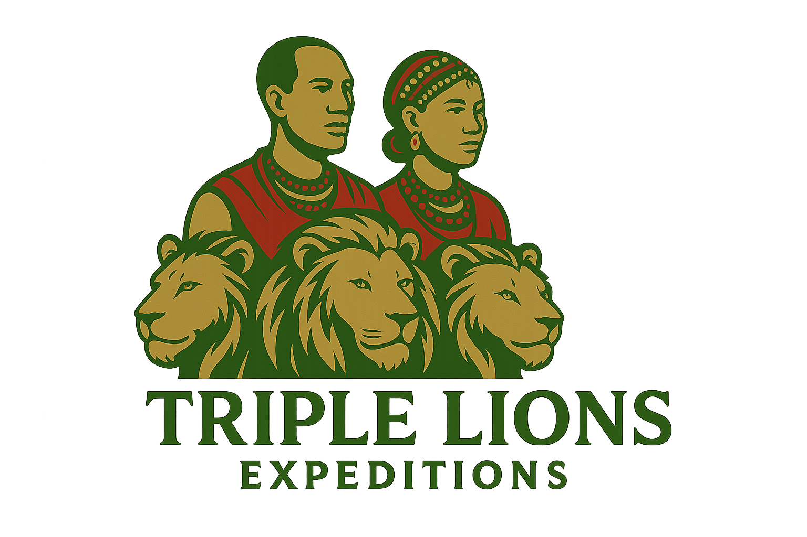

# 🦁 Triple Lions Expeditions - Premium Tanzania Safari Website



## 🌟 Overview

Triple Lions Expeditions is a premium safari company specializing in unforgettable Tanzania wildlife adventures. This website showcases our world-class safari packages, mountain climbing expeditions, and beach holidays in East Africa's most spectacular destinations.

## 🚀 Features

### ✨ **Professional Design**
- **Stunning Hero Section** with high-quality safari imagery
- **Responsive Design** that works perfectly on all devices
- **Modern UI/UX** with smooth animations and hover effects
- **Professional Color Scheme** with safari-inspired earth tones

### 🏔️ **Comprehensive Safari Packages**
- **Great Migration Safari** - Witness the spectacular wildebeest migration
- **Kilimanjaro Adventure** - Conquer Africa's highest peak
- **Bush to Beach** - Combine safari with Zanzibar relaxation
- **Big Five Safari** - Spot all the iconic African wildlife

### 🎯 **Key Sections**
- **About Us** - Company expertise and values
- **Destinations** - Detailed information about Tanzania's national parks
- **Climbing & Trekking** - Multiple Kilimanjaro routes and mountain adventures
- **Testimonials** - Real customer experiences and reviews
- **Contact** - Easy booking and inquiry system

### 📱 **Interactive Features**
- **WhatsApp Integration** for instant customer support
- **Route Details Modal** with comprehensive trekking information
- **Smooth Scrolling** navigation
- **Mobile-Optimized** design

## 🛠️ **Technology Stack**

- **HTML5** - Semantic markup and structure
- **CSS3** - Modern styling with Flexbox and Grid
- **JavaScript** - Interactive functionality and animations
- **Font Awesome** - Professional icons
- **Google Fonts** - Beautiful typography (Poppins)
- **Unsplash** - High-quality safari photography

## 📁 **Project Structure**

```
TES/
├── index.html              # Main homepage
├── destinations.html        # Destinations and climbing page
├── thank-you.html          # Contact form confirmation
├── styles.css              # Main stylesheet
├── script.js               # JavaScript functionality
├── TES LOGO.png            # Company logo
├── favicon.svg             # Website icon
├── SETUP-EMAIL.md          # Email configuration guide
└── README.md               # Project documentation
```

## 🎨 **Design Highlights**

### **Color Palette**
- **Primary**: Safari gold (#C9B882)
- **Secondary**: Forest green (#6B8E23)
- **Accent**: Warm orange (#F59E0B)
- **Text**: Professional dark gray

### **Typography**
- **Headings**: Poppins Bold (700)
- **Body**: Poppins Regular (400)
- **Accent**: Poppins Medium (500)

### **Layout**
- **Grid-based** responsive design
- **Card-based** content presentation
- **Glassmorphism** effects for modern appeal
- **Smooth animations** and transitions

## 🌍 **Safari Destinations Featured**

### **Northern Circuit**
- **Serengeti National Park** - Great Migration and Big Five
- **Ngorongoro Crater** - World's largest intact caldera
- **Tarangire National Park** - Elephant herds and baobabs
- **Lake Manyara** - Tree-climbing lions
- **Mount Kilimanjaro** - Africa's highest peak
- **Arusha National Park** - Walking safaris and canoeing

### **Coastal & Islands**
- **Zanzibar** - Pristine beaches and spice tours
- **Pemba Island** - Diving and cultural experiences
- **Mafia Island** - Marine conservation and fishing

### **Southern Circuit**
- **Ruaha National Park** - Largest and wildest safari destination
- **Mikumi National Park** - Easy access from Dar es Salaam
- **Selous Game Reserve** - Boat safaris and walking tours
- **Udzungwa Mountains** - Hiking and primate viewing

## 🏔️ **Mountain Adventures**

### **Kilimanjaro Routes**
- **Marangu Route** (5-6 days) - "Coca-Cola" route with huts
- **Machame Route** (6-7 days) - Scenic with Barranco Wall
- **Lemosho Route** (8-9 days) - Most scenic and best acclimatized
- **Rongai Route** (6-7 days) - Northern approach, less crowded
- **Umbwe Route** (6-7 days) - Steepest, for experienced climbers

### **Other Mountains**
- **Mount Meru** - Perfect Kilimanjaro warm-up
- **Ol Doinyo Lengai** - "Mountain of God" active volcano
- **Usambara Mountains** - Cultural trekking experiences

## 📞 **Contact Information**

- **Email**: lkuresoi@gmail.com
- **Phone**: +255756336142
- **Office**: Mkabala na Chuo Cha Bishop Durning, Ilboru, Arusha, Tanzania
- **P.O. Box**: 1187, Arusha 23227

## 🚀 **Getting Started**

### **Local Development**
1. Clone the repository
2. Open `index.html` in your web browser
3. Or use a local server:
   ```bash
   npx serve . -p 8080
   ```

### **Live Demo**
Visit: [http://localhost:8080](http://localhost:8080)

## 📱 **Responsive Design**

The website is fully responsive and optimized for:
- **Desktop** (1200px+)
- **Tablet** (768px - 1199px)
- **Mobile** (320px - 767px)

## 🎯 **SEO Features**

- **Semantic HTML** structure
- **Meta tags** for search engines
- **Alt text** for all images
- **Structured data** for better indexing
- **Fast loading** optimized images

## 🔧 **Customization**

### **Colors**
Update CSS variables in `styles.css`:
```css
:root {
    --primary-color: #C9B882;
    --secondary-color: #6B8E23;
    --accent-color: #F59E0B;
}
```

### **Content**
- Update package information in HTML
- Modify testimonials and reviews
- Change contact information
- Update destination descriptions

## 📈 **Performance**

- **Optimized images** from Unsplash CDN
- **Minified CSS** and JavaScript
- **Fast loading** with preconnect links
- **Mobile-first** responsive design

## 🤝 **Contributing**

1. Fork the repository
2. Create a feature branch
3. Make your changes
4. Submit a pull request

## 📄 **License**

This project is licensed under the MIT License - see the LICENSE file for details.

## 🙏 **Acknowledgments**

- **Unsplash** for high-quality safari photography
- **Font Awesome** for professional icons
- **Google Fonts** for beautiful typography
- **Tanzania National Parks** for conservation efforts

## 📞 **Support**

For support or inquiries:
- **Email**: lkuresoi@gmail.com
- **Phone**: +255756336142
- **WhatsApp**: Available on website

---

**Triple Lions Expeditions** - *Where Wildlife Meets Wonder!* 🦁✨

*Experience the magic of Tanzania with Africa's premier safari specialists.*